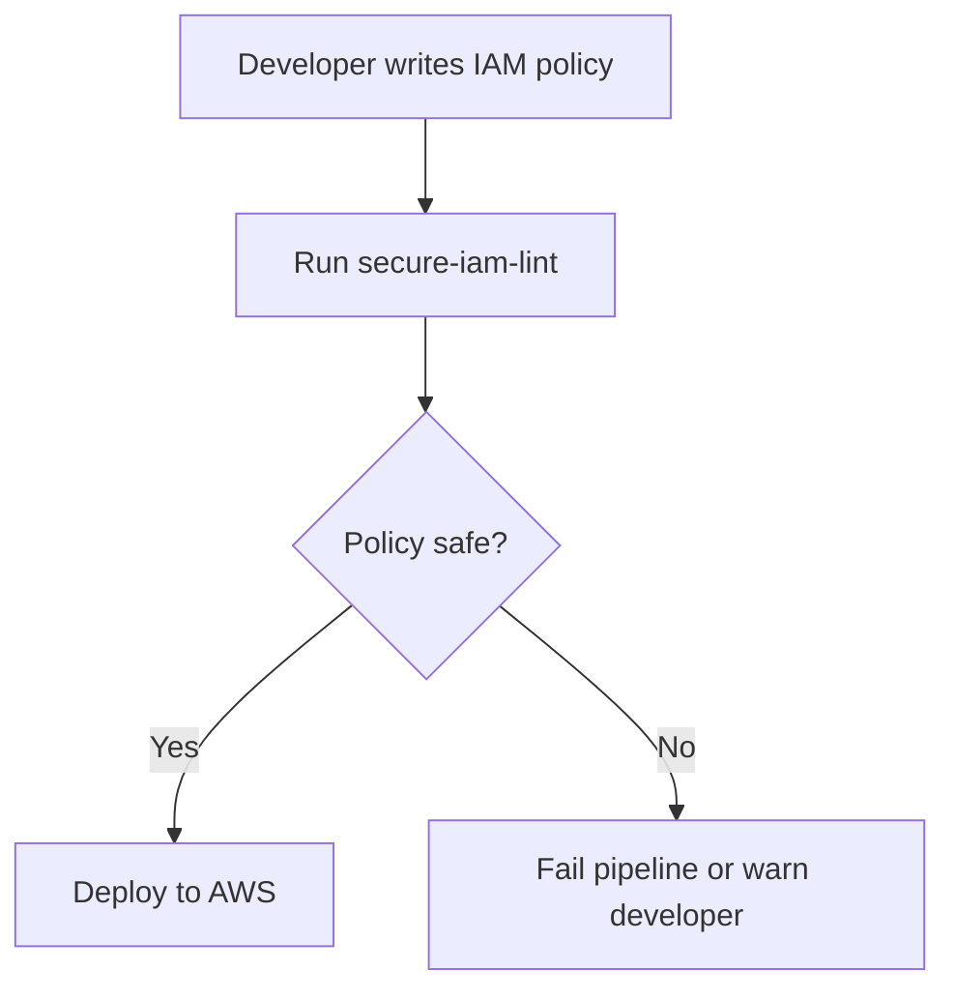

# secure-iam-lint

**Scan your IAM policies before they hit prod.**  
`secure-iam-lint` catches common misconfigurations in AWS IAM policies with a simple CLI or CI step.

## Why

Overly permissive IAM policies are one of the most common and dangerous misconfigurations in AWS environments. This tool helps identify risky patterns before they're deployed, keeping your infrastructure secure by default.

## How It Works



## Install

For now:

```bash
git clone https://github.com/coldbootsec/secure-iam-lint.git
cd secure-iam-lint
python3 -m venv .venv && source .venv/bin/activate
pip install .
```

Coming soon:

```bash
pip install secure-iam-lint  # coming soon
```

## Usage

```bash
iam-lint examples/bad-policy.json
```

## Example Output

```
[!] Findings:
 - Statement 0: Action includes '*' (overly permissive)
 - Statement 0: Resource includes '*' (overly permissive)
 - Statement 0: Allow without any Condition block
 - Statement 1: Allow without any Condition block
 - Statement 1: Uses sts:AssumeRole with wildcard
 - Statement 1: Grants iam:PassRole without Conditions
```

## Current Rules

| Rule                             | Description                                  |
|----------------------------------|----------------------------------------------|
| `*` in Action or Resource        | Detects wildcard permissions                 |
| Allow without Condition          | Warns on unconditional access                |
| Privilege Escalation Patterns    | Detects dangerous combinations (e.g. PassRole + wildcard) |
| sts:AssumeRole with Wildcard     | Flags open trust policies                    |

## CI Integration

```yaml
- name: Lint IAM policies
  run: |
    pip install .
    iam-lint path/to/policies/
```

## Examples

See [`examples/bad-policy.json`](examples/bad-policy.json) and [`examples/escalation-risk.json`](examples/escalation-risk.json) for policy samples that trigger linter warnings.

## Project Structure

```text
secure-iam-lint/
├── iamlint/
│   ├── __init__.py
│   ├── cli.py
│   └── rules.py
├── examples/
│   ├── bad-policy.json
│   └── escalation-risk.json
├── tests/
│   └── test_rules.py
├── iam_lint.py
├── setup.py
└── README.md
```

## Contributing

Issues and pull requests are welcome. Open a discussion if you have an idea for a new rule.

## License

MIT
